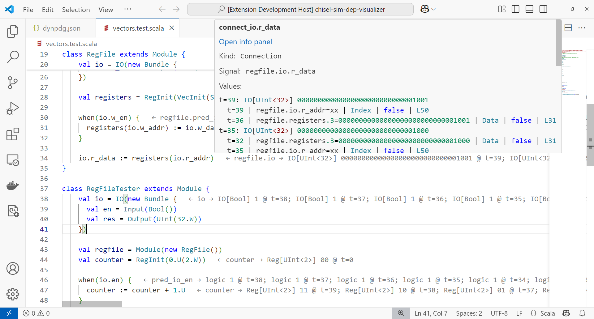

# Automated Dependency Analysis with ChiselTrace

Debugging hardware designs often feels like searching for a needle in a haystack. Traditional waveform viewers force engineers to manually trace signals through complex hierarchical designs. This task is error-prone and often leads to long debug sessions.

Tywaves is able to reconstruct Chisel constructs in the waveform viewer. We take this one step further and provide automation of dependency tracing at the source-language level using ChiselTrace. When the user notices a wrong value in the waveform viewer or through a failed assertion, the entire execution history that led to the wrong value can be reconstructed automatically, allowing the developer to more easily trace signal relations and find the fault.

ChiselTrace reconstructs *source-level control and data flow* from Chisel designs, combining static program dependence graphs with dynamic simulation data. The result is a causal graph that shows relations between Chisel statements over time. ChiselTrace even integrates with the Tywaves library to show typed data flow between statements.

## How does it work?

1. A custom phase in the Chisel library collects a PDG and CFG from the FIRRTL circuit, while inserting probes into the circuit
1. Using this information in conjunction with simulation data, ChiselTrace reconstructs control flow
1. A Dynamic PDG is built and the Chisel view is reconstructed
1. The generated DPDG is shown in our causal dependency graph viewer

