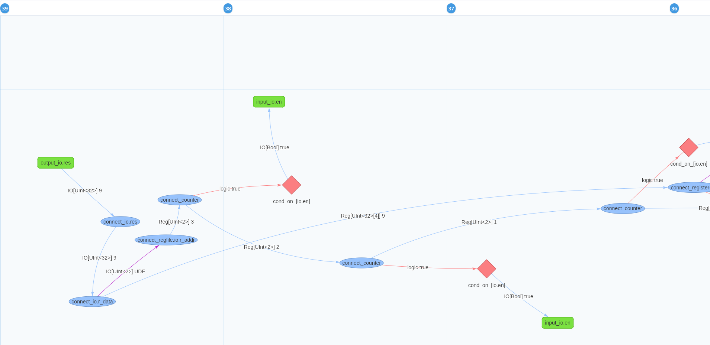

# Saving hardware design effort – documentation

At the Accelerated Big Data Systems group we are committed to build develop tools and implementations that push the envelope for accelerating computational tasks. This **documentation website** contains our projects related to digital hardware design. These tools tackle the challenges that make digital hardware design difficult. Our motto is therefore:

*Digital hardware design is hard enough as it is, why should the tooling hold you back?*

---

## Projects

This website contains documentation for the following projects (plus some extra bits).

---

### Better waveforms

{ align=left width="500" }

Tywaves is a type-aware waveform viewer that bridges the gap between high-level Chisel designs and low-level RTL debugging. By preserving source code structure, types, and module hierarchies, Tywaves enables intuitive, efficient debugging directly aligned with your original Chisel code—no more deciphering auto-generated RTL. Fully compatible with ChiselSim and demonstrated on the ChiselWatt OpenPOWER processor, Tywaves redefines how you visualize and debug hardware designs.

[Discover Tywaves](./debugtools/tywaves.md){ .md-button }
 

---
  
### Get insight in your signal dependencies

{ align=right width="600" }

ChiselTrace is a tool that allows you to trace back signal dependencies in a source-language view. When a value is wrong or an assertion fails, it builds a causal execution history—revealing how that value was computed.

By combining static PDG and CFG from FIRRTL with simulation data, ChiselTrace creates an interactive graph of control and data flow between Chisel statements, complete with typed data flow. This makes debugging faster, more intuitive, and focused directly on the source.

[Discover ChiselTrace](./debugtools/chiseltrace.md){ .md-button }
 

---

### Communicate complex data between components – like a breeze

{ align=left width="500" }

Tydi (Typed Dataflow Interface) is a specification that provides the same maturity for defining complex component interfaces, as modern HSL paradigms provide for building the components. In conjunction with modern trends, it provides:

1. A Type system for defining complex, variable data structures,
2. Formally verified data transmission methodology,
3. Interface HDL generators for Chisel, VHDL, Verilog, etc, and
4. Engineering parameters to fine-tune that interface. 

[Discover Tydi](./tydi/what-is-tydi.md){ .md-button }

