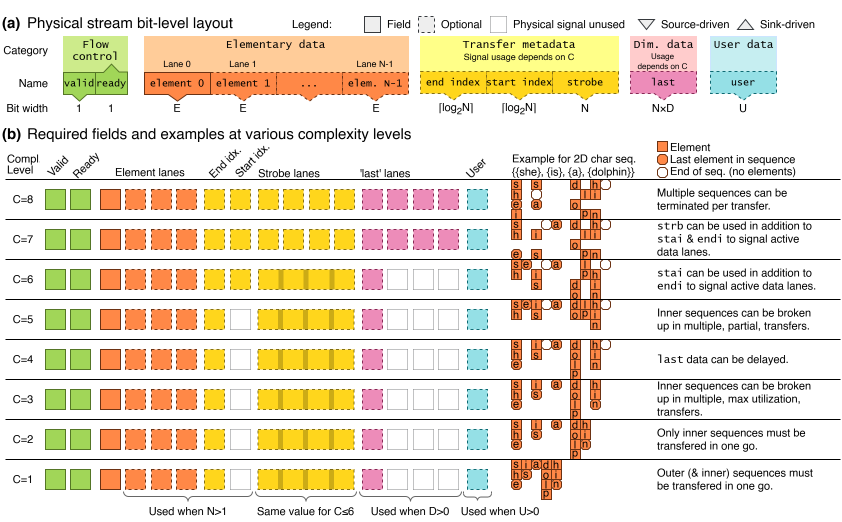

# Understanding Tydi

Tydi is a standard to exchange complex data types with variable-length sequences in a straightforward and HDL-agnostic manner.
Variable-length refers to that the length of the sequence can be unknown when a data-stream starts. More information in the section [dimensionality information](#dimensionality-or-length-information).

This getting-started guide will introduce you to Tydi's core principles and concepts.

## Structure elements
Transferring data of any complexity starts at defining the data structure. Tydi is designed to be able to represent any hierarchical data-structure. In the following sections, the Tydi building-blocks (called _elements_) that can be used to build a data-structure are listed.

### Bits
A `bits` element represents any ground type, such as booleans, integers, floating or fixed point numbers, characters, etc.

### Null
A `null` element indicates the absence of any value.

### Group
A `group` element is, unsurprisingly, a set of other structure elements grouped together as named leafs of the `group`.

This concept exists in almost all higher programming language in the form of a `struct`ure, `dict`ionary, `object`, `dataclass`, `case class`, etc. etc.

A `group` can contain all other elements.

### Union
A `union` element represents a choice in the type of data that should be transmitted (_one of_, whereas a `group` is _all of_). Its functionality is slightly more complicated than other elements because the structure it represents is non-constant.

It is similar to C's `union` construct, except a choice _must_ be made about what data is represented at any given time.

A `union` can contain all other elements.

??? info "Explanation of operation"

    The following pseudocode illustrates this concept. A `union` with three options (a ground type `bits`, `stream`, and `null`)
    ```typescript
    type SomeBits = Bits(8)
    type SomeGroup = { a: Bits(4), b: Bits(8) } \\ Has combined width of 12
    type SomeStream = ...

    type SomeUnion = Union {
        option1: SomeBits,
        option2: SomeGroup,
        option3: SomeStream,
        option4: null
    }
    ```
    When this is synthesized, it will become
    ```typescript
    type SomeUnion = Union {
        tag: Bits(ceil(log2(3))),
        data: Bits(max(|SomeBits|, |SomeGroup|, |SomeStream|, |null|))
    }
    ```
    or

    ```typescript
    type SomeUnion = Union {
        tag: Bits(2),
        data: Bits(12)
    }
    ```

    The `data` field will contain the data of the field that is selected by the `tag` value. Any stream will have a bitwidth of `0` for the calculation as each stream is exposed separately, but the validity of the stream's value is still controlled by the `tag` field.

### Stream
A `stream` element is used to represent a data sequence of 1 or higher dimension.

Such a sequence naturally translates to all forms of `seq`uence, `array`, `list`, `vector`, etc. etc.
Specifically, it also includes `string`s.

A stream can contain any element.
!!! note "Directly nesting streams"
    A stream can even directly contain another stream. This is, however, not useful in most situations and only applicable in select situations. Normally you would increase the `dimensionality`.

## Dissection of a stream

In essence a `stream` is very similar to the universal concept of a handshaked signal. A handshaked signal consists of 3 sub-signals: `ready`, `valid`, and `data`. `valid` is used by the data-source to indicate that the data currently present on the `data` signal is valid and ready for transfer. `ready` is used by the data-sink to indicate that it (the sink component) is ready to receive data. When both `ready` and `valid` are asserted at the same time, a '_transfer_' takes place at the next active clock edge.

A Tydi stream is therefore a handshaked signal with a (maybe complexly) nested but fixed wire bundle as `data` sub-signal. What differentiates it starts at the dimensionality information.

### Dimensionality (or length) information
There are generally to ways to indicate the length of a variable length array (such as a string of characters).

- Have a **termination flag** or packet  
  This is the way C determines the length of a string. The string always ends with a _null-termination_ character (`\0`)
- **Save the length** of the sequence  
  This is the way vectors work, such as `vector<char>`. The data structure will contain

Tydi works with termination flags. These are called `last` bits. A $D$-dimensional stream will have `D` `last` bits, one to close off each dimension.

#### Empty sequences and example
When transferring multidimensional data, it can happen that one of the dimensions does not contain lower dimensional sequences or data. Take, for example, the following slice of three-dimensional data:

```javascript
data = [[[1, 2, 3], [4, 5]], [[ /* empty d3 */ ], [6, 7]], [ /* empty d2 */ ]]
```
The comments indicate empty subsequences at the lowest and middle dimensions. This is supported by setting `last` flags appropriately.

- The element `3` closes off the lowest dimension, so its `last` value will be `001`.
- The element `4` does the same but also closes off the second dimension, so its `last` value is `011`.
- The next empty list also closes of the lowest dimension, but there is no data, so an 'empty' packet is sent with a `last` value of `001`.
- The last empty list closes off the second dimension, resulting in an empty packet with `last=010`. Notice how the lowest dimension is not closed. This indicates that there was _no empty sequence_ at that dimension.

This shows an important distinction between 'normal' packets and 'empty' packets.

A normal, data-containing, packet will **always** contain data at the lowest dimension (level $D$). A data packet that ends the sequence will, therefore, **always** close off the lowest dimension.

Empty packets are an exception because there is no actual _data sequence_ to close off. Therefore, an empty packet can close off a higher dimension without closing all lower ones as well.

How empty packets can be defined (in the sense of transferred) will be discussed later.

## Engineering parameters
By now we have collected the following signals: `ready`, `valid`, `data`, and `last`. For basic cases, this is all you need. However, Tydi supports some engineering parameters that allow designers to tune the performance and operation of their interfaces.

### Throughput
To achieve higher throughput than is possible by sending one element at a time, a stream supports having multiple **lanes**. Each lane can transfer one element per transfer. A stream is said to have $N$ lanes.

When a stream has multiple lanes ($N>1$), the handshaking of the signal still goes through the `ready` and `valid` signals. However, as the length of the data might not align with a multiple of $N$, a strategy to show which lanes carry element data and which do not is needed. Three signals are introduced that allow toggling lanes on and off. Their behavior depends on how the protocol is tuned, which is explained in the next section.

- `stai` (start index) specifies from which index lanes should be considered to carry valid data.
- `endi` (end index) specifies up to which index (inclusive) lanes should be considered to carry valid data.
- `strb` (strobe) is a bitmask of $N$ bits that specifies 1:1 which lanes should be considered to carry valid data.

For any given lane of index $i$, the validity is given by $(\text{stai} \le i \le \text{endi}) \wedge (\text{strb}[i])$.

### Protocol tuning
To allow further customization of performance and offer a trade-off between source transfer generation effort and sink transfer reception effort, the Tydi protocol knows various variations. These are known as the protocol complexity level. A low protocol-complexity is very straightforward to understand, but does not allow for the highest throughput performance or processing flexibility. Examples of what protocol complexities exist and what transfers look like at these complexities are shown in the next section.

## Visual signal overview
The following diagram contains a visual explanation of each signal and their use at each protocol complexity level, together with an example transfer of the same data at that protocol-complexity. The data being transferred is a 2D character sequence: `["she", "is", "a", "dolphin"]`.



## Stream interrelationships

The previous text explains how a stream works, but also that elements can be nested arbitrarily. This includes other streams. The structure that is transfered by a stream can thus include other streams. We call these _nested streams_. This functionality is essential for transferring complex data.

!!! tip
    A simple structure like a multi-dimensional matrix may be transmitted using Tydi, but a singular structure like this alone uses a single stream with some dimensionality $d$. As such, it does not benefit from Tydi's nesting flexibility.

Nesting happens when transferring a structure that has a nested list somewhere. Think, for example, about a list of posts that each have a list of tags.

!!! example "Minimal post with tags structure"
    ```typescript
    type root = post[];
    type post = Group {
      tag: string[]
    }
    ```

The following example block shows a complete version of the example with a richer structure.

??? example "Complete post list example"
    We will use the list of posts example to explain various aspects of Tydi's functionality. An example may look like this
    ```json
    [
      {
        "postId": 123,
        "title": "Exploring the Hidden Gems of Andalusia",
        "content": "Just returned from an amazing trip through Andalusia! The Alhambra was breathtaking, and the food in Seville was incredible. Highly recommend visiting the white villages of Grazalema and Ronda.",
        "author": {
          "userId": 456,
          "username": "TravelBug_88"
        },
        "createdAt": "2025-06-15T10:30:00Z",
        "updatedAt": "2025-06-15T11:00:00Z",
        "tags": [
          "Travel",
          "Spain",
          "Food"
        ],
        "likes": 125,
        "shares": 15,
        "comments": [
          {
            "commentId": 1,
            "author": {
              "userId": 789,
              "username": "CultureVulture"
            },
            "content": "Oh, Andalusia is truly magical! Did you get a chance to see any flamenco shows in Seville?",
            "createdAt": "2025-06-15T12:05:00Z",
            "likes": 10
          },
        ]
      }
    ]
    ```

In the case of a post with tags, we have two streams:

- A stream of **posts**
    - A stream of **tags**

The posts stream sends a *sequence* of post items. Each *item* of this posts stream will have a corresponding *sequence of items* in the tags stream. According to general convention we call the posts stream the parent stream of the tags stream and the tags stream itself the child or nested stream.

The list/sequence of tags for a stream may, of course, be empty. In this case, an *empty* item will be transmitted as explained in [the empty sequences section](#empty-sequences-and-example).

The relationship and association between items transmitted in a parent and child stream must be tracked by the source and sink components based on the dimensionality information in the `last` signal. On the level of Tydi's transfer protocol (disregarding semantic meaning and focussing purely on the signal behavior), each stream, nested or not, operates mostly *independently* using the same protocol. The only inter-stream dependency that is relevant for the transfer protocol relates to **deadlock avoidance**.

!!! warning "Deadlocks"
    Deadlock occurs when there is a circular awaiting going on between sender and receiver components marking the items `valid`/`ready` of two or more streams.

To prevent the possibility of deadlocks, Tydi prescribes which logical dependencies the funtionality of a component is allowed to have based on the Tydi structure of its interface. For more details, read about the [natural ordering principle](../tydispec/logical.md#natural-ordering-and-inter-stream-dependencies), especially the example.

## Technical details

Exact details of operation such as allowed conditions for certain signal behaviors are specified in the technical specification, called the Tydi spec. Check out the [Tydi spec](../tydispec/intro.md).

## Getting started with Tydi

Now that you know what Tydi is and how it works in broad terms, you are ready to get started and experiment with Tydi yourself. One easy way to do that is with the [Tydi Playground](./playground.md). Here you can see how your own data would translated to a Tydi representation and how this data would be transfered over an interface, or build a structure yourself.
